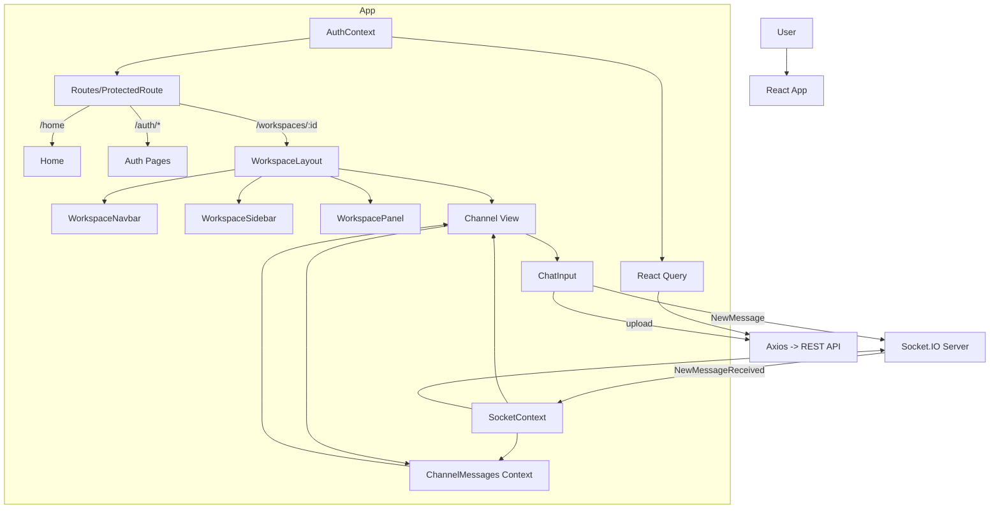

# MessageSlack Frontend (React + Vite)

This is a Slack‑like messaging frontend built with Vite + React. It uses React Router for navigation, TanStack Query (React Query) for data fetching/caching, Socket.IO for realtime updates, and a small set of React Context providers to manage auth, workspace/channel selection, messages, and modal state. The app talks to a backend via REST (Axios) and websockets.

ShadCN Setup: [Link](https://ui.shadcn.com/docs/installation/vite)

Atomic Design: [Link](https://medium.com/@janelle.wg/atomic-design-pattern-how-to-structure-your-react-application-2bb4d9ca5f97)

## Tech Stack
- React, Vite, React Router
- TanStack Query (React Query)
- Socket.IO client
- Axios
- Tailwind + shadcn/ui

## Environment
Set the following Vite env variables:
- `VITE_BACKEND_API_URL` — REST API base URL
- `VITE_BACKEND_SOCKET_URL` — Socket.IO base URL

## High‑Level Workflow
1) Boot: `src/main.jsx` mounts `<App/>`. `src/App.jsx` provides React Query and composes app contexts, routes, global modals, and toaster.
2) Routing/Guarding: `src/Routes.jsx` directs `/` to `/home` if authenticated, else `/auth/signin`. Protected routes use `<ProtectedRoute/>` (reads `AuthContext`).
3) Auth: `useSignup` and `useSignin` call `/users/signup` and `/users/signin`. On signin, token+user are stored in localStorage and `AuthContext`, then navigate to `/home` or complete a pending workspace join.
4) Home: fetches user workspaces. If none, opens Create Workspace modal; otherwise navigates to the first workspace.
5) Workspace: `WorkspaceLayout` joins the workspace Socket.IO room and subscribes to `WorkspaceUpdated` to invalidate queries. Navbar fetches workspace details and sets current workspace context. Sidebar shows navigation; left panel lists channels and members/DMs.
6) Channel: fetches channel details and initial messages; joins the channel via Socket.IO. Incoming messages append to `ChannelMessages` context. `ChatInput` uses a Quill editor; optional image upload hits `/messages/upload` before emitting `NewMessage` over the socket.
7) DMs/Notifications: Users can open a DM (creates/fetches a DM channel) and act on DM invites (accept/reject), updating related queries.

## External APIs & Sockets
- REST (Axios via `src/config/axiosConfig.js`):
  - Auth: `POST /users/signup`, `POST /users/signin`
  - Workspaces: `GET/POST/PUT/DELETE /workspaces`, `GET /workspaces/:workspaceId`, `PUT /workspaces/:workspaceId/channels`, `PUT /workspaces/:workspaceId/join`, `PUT /workspaces/:workspaceId/joinCode/reset`, `PUT /workspaces/:workspaceId/members`, `POST /workspaces/:workspaceId/invite-email`, `DELETE /workspaces/:workspaceId/members/:memberId`
  - Channels: `GET /channels/:channelId`
  - Messages: `GET /messages/:channelId`, `POST /messages/upload`
  - DMs: `POST /dms`, `GET /dms/:workspaceId`, `POST /dms/invite`, `GET /dms/invites/:workspaceId`, `GET /dms/invites`, `POST /dms/invite/:inviteId/:action`
- WebSocket (Socket.IO):
  - Emits: `JoinWorkspace`, `JoinChannel`, `NewMessage`
  - Listens: `WorkspaceUpdated`, `NewMessageReceived`

## Key Modules & Roles
- Contexts: `AuthContext`, `SocketContext`, `WorkspaceContext`, `ChannelMessages`, and modal contexts. Provide app‑wide state and helpers.
- API modules: `src/apis/*` wrap Axios calls; React Query hooks in `src/hooks/apis/*` orchestrate caching, cache invalidations, toasts, and navigation.
- Pages: `Home` (workspace routing/creation), `Workspace/Layout` (frame + socket join), `Channel` (messages), `DMList`, `Notifications`, `JoinPage`, and `Auth` layout.
- Components: `Workspace*` (navbar/sidebar/panel), modals (create workspace/channel, preferences, invite), `ChatInput` (Quill editor + upload), and `Message` renderer.

## Simplified Data Flow


## Module Dependencies (Frontend)
```mermaid
graph TD
  subgraph Entry
    M[src/main.jsx] --> AP[src/App.jsx]
  end

  AP --> ACP[src/context/AppContextProvider]
  AP --> AR[src/Routes.jsx]
  AP --> MOD[src/components/organisms/Modals/Modals.jsx]
  AP --> TOAST[src/components/ui/toaster.jsx]

  ACP --> C1[ChannelMessagesProvider]
  ACP --> C2[SocketContextProvider]
  ACP --> C3[AuthContextProvider]
  ACP --> C4[WorkspaceContextProvider]
  ACP --> C5[CreateWorkspaceContextProvider]
  ACP --> C6[WorkspacePreferencesModalContextProvider]
  ACP --> C7[CreateChannelContextProvider]

  AR --> PR[src/components/molecules/ProtectedRoute/ProtectedRoute.jsx]
  AR --> PAGES[Pages]
  PR --> UA[src/hooks/context/useAuth.js]

  subgraph Pages
    HOME[src/pages/Home/Home.jsx]
    LYT[src/pages/Workspace/Layout.jsx]
    CHAN[src/pages/Workspace/Channel/Channel.jsx]
    DMS[src/pages/Workspace/DMs/DMList.jsx]
    NOTI[src/pages/Workspace/Notifications/Notifications.jsx]
    JOIN[src/pages/Workspace/JoinPage.jsx]
  end

  HOME --> H_Q[src/hooks/apis/workspaces/useFetchWorkspace.js]
  H_Q --> API_WS[src/apis/workspaces/index.js]

  LYT --> USOCK[src/hooks/context/useSocket.js]
  LYT --> RQ[src/@tanstack/react-query]

  CHAN --> GCBI[src/hooks/apis/channels/useGetChannelById.js]
  CHAN --> GCM[src/hooks/apis/channels/useGetChannelMessages.js]
  CHAN --> UCM[src/hooks/context/useChannelMessages.js]
  CHAN --> USOCK
  GCBI --> API_CH[src/apis/channels/index.js]
  GCM --> API_CH

  DMS --> LDM[src/apis/dms/index.js]
  NOTI --> LDM
  JOIN --> JWS[src/hooks/apis/workspaces/useJoinWorkspace.js]
  JWS --> API_WS

  CI[src/components/molecules/ChatInput/ChatInput.jsx] --> UP[src/apis/uploads/index.js]
  CI --> USOCK
  UP --> AXCFG[src/config/axiosConfig.js]

  API_WS --> AXCFG
  API_CH --> AXCFG
  LDM --> AXCFG
```

## Notes
- Axios interceptor redirects to `/auth/signin` on 401/403 and clears local auth.
- `CreateChannelContext.jsx` currently uses `new createContext()` which likely needs to be `createContext()`.
